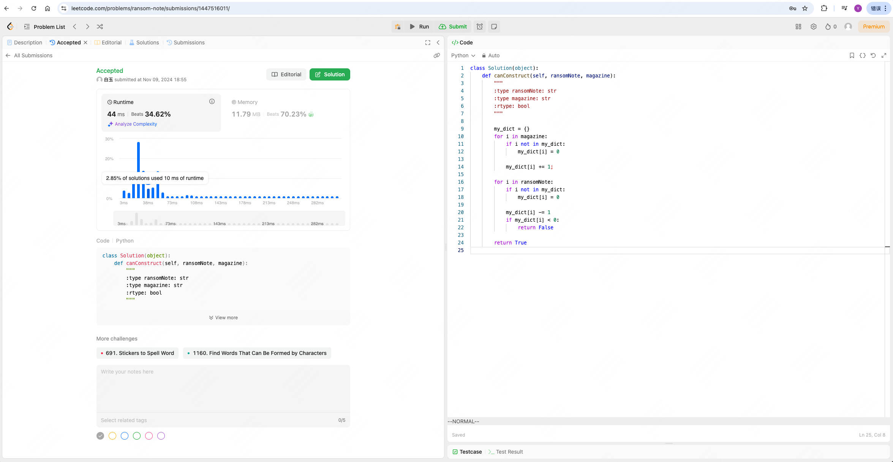

* Leetcode 383(笔记中提交代码与leetcode提交通过截图)	




* Vscode连接InternStudio debug笔记

bug 为：

```
Traceback (most recent call last):
  File "/root/by/shusheng/L0G2000/intern_studio.py", line 35, in <module>
    res_json = json.loads(res)
               ^^^^^^^^^^^^^^^
  File "/root/.conda/lib/python3.11/json/__init__.py", line 346, in loads
    return _default_decoder.decode(s)
           ^^^^^^^^^^^^^^^^^^^^^^^^^^
  File "/root/.conda/lib/python3.11/json/decoder.py", line 337, in decode
    obj, end = self.raw_decode(s, idx=_w(s, 0).end())
               ^^^^^^^^^^^^^^^^^^^^^^^^^^^^^^^^^^^^^^
  File "/root/.conda/lib/python3.11/json/decoder.py", line 355, in raw_decode
    raise JSONDecodeError("Expecting value", s, err.value) from None
```

bug的原因是因为返回结果不符合json格式

```
```json
{
    "model_name": "书生浦语InternLM2.5",
    "developer": "上海人工智能实验室",
    "parameter_versions": [1.8B, 7B, 20B],
    "max_context_length": 1000000
}
\```


```

我们加上一行代码，让结果符合json格式：
```
res = res.strip("```json\n").strip("```\n")
```

output:

```
{'model_name': '书生浦语InternLM2.5', 'developer': '上海人工智能实验室', 'parameter_versions': ['1.8B', '7B', '20B'], 'maximum_context_length': '1M'}
```